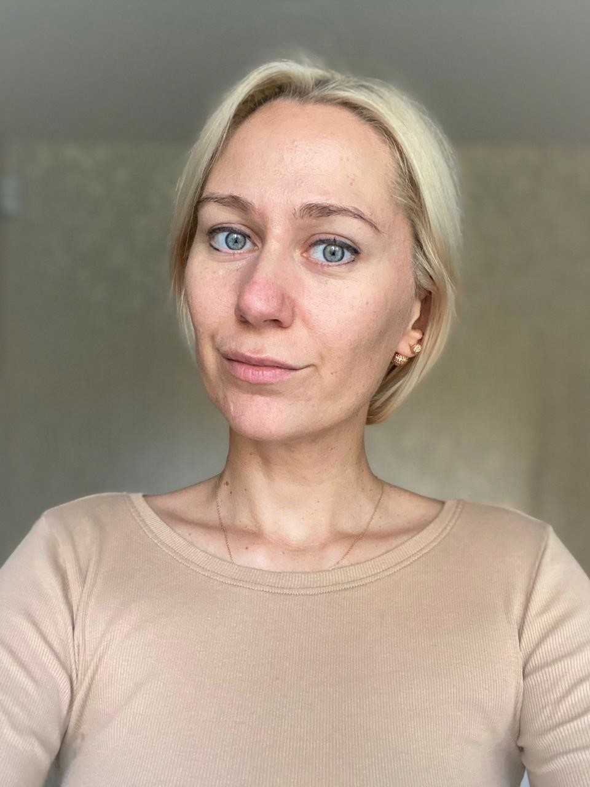
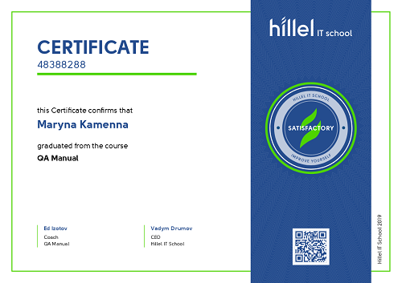
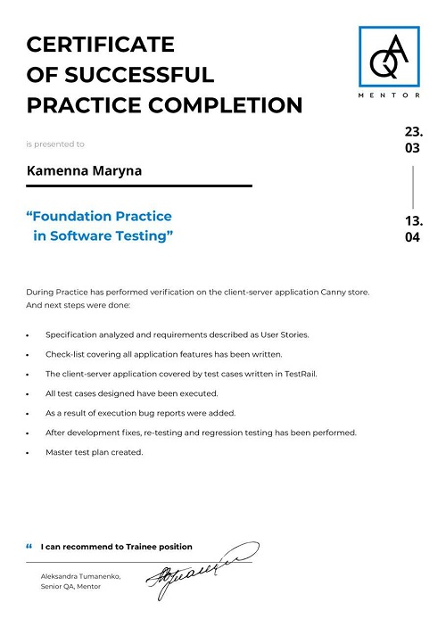
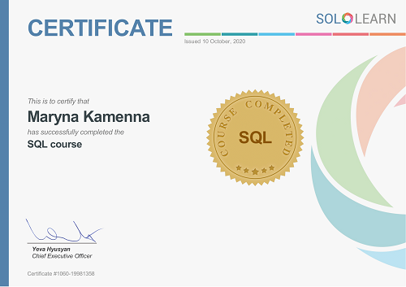

<!DOCTYPE html>
<html lang="en">

<head>
  <meta charset="UTF-8">
  <meta name="viewport" content="width=device-width, initial-scale=1.0">
  <meta http-equiv="X-UA-Compatible" content="ie=edge">
  <title>Kamenna Maryna CV</title>
  <body>
     <header>
        <article>
  <h1>Kamenna Maryna Junior QA </h1>
    
Hello, my name is Maryna, and I am looking for Junior QA  position in Odessa.
      I have expirience in Web application testing whith API testing (Postman).
      Performed all types of testing activities(static and dynamic) and has experience with all test documentation types.
      

   </article>
   </header>
   <aside>
   
         <h3>Contacts & links</h3> 
    <section>
        
Telephone <a href="tel:0631330711" title="Phone Number " target="_blank"> (063)133-07-11</a>   

        
Email <a href="mailto:marinastoneqa@gmail.com" title="Email" target="_blank"> marinastoneqa@gmail.com </a> 

        
Instagram <a href="https://www.instagram.com/marinastone_" title ="Instagram" target="_blank"> marinastone_</a> 

        
LinkedIN <a href="https://www.linkedin.com/in/maryna-kamenna-1330711/" title="=LinkedIN" target="_blank"> maryna-kamenna </a>

    </section>
          <h3>Tech skills</h3>
 

      <ul> 
    <li>HTML5&CSS</li>
    <li>GIT</li>
    <li>SQL</li>
    <li>Postman</li>
    <li>Jira, Trello, TestRail, CRM</li>
   </ul>

   
          <h3>Soft skills</h3>
      

         <ul>
             <li>English (intermediate)</li>
             <li>Romanian (elementary)</li>
              <li>Selfeducation</li>
             <li>Agile</li>
             <li>Scram</li>
             <li>Teamwork</li>
          </ul>
         

   </aside>
   <article>
      <h2>Work Expirience</h2>
      <section>
      <h3>Afenex Personal assistant</h3>
      <h4>October 2018 - November 2019</h4>
         <ul>
           <li> Performed general office duties and administrative tasks</li>
              <li>Schedule client appointments</li> 
              <li>Managed the internal and external mail, calls.</li>
              <li>Provided telephone support.</li>
         </ul>
      </section>
      <section>
      <h3>Make-up artist  Freelancer</h3>
      <h4>Desember 2015 - March 2018</h4>
   </section>

      <h3>Ukrticket Theater casher</h3>
      <h4>November 2013 - October 2015</h4>  
         <ul>
             <li>Increased recognizably and number of customers at the point of sale</li>
             <li>Information and sale of tickets for cultural and sporting events, tickets for he railway, air, buses</li>
             <li>Acceptance of cash, filling out receipts, keeping funds</li>
        </ul>
      <h3>"Своё Такси" Dispatcher taxy</h3>
      <h4>September 2008 - October 2013</h4>
         <ul>
              <li>Two months later, I became head dispatcher</li>
              <li>Over the past 5 years, taxi service has grown from 30 cars to 250, and the base of regular customers has grown by 10 times</li>
              <li>Maintain and develop existing customer base</li>
              <li>Providing reference information regarding prices, range and terms of ordering a taxi</li>
              <li>Providing telephone reception of customer orders</li>
          </ul>
         </article>
      
          <h2>Education</h2>
          <section>
               <h3>Odessa National University of I.I Mechnikov</h3>
                 <h4>September 2006 - June 2014 Obtained the MS degree in Since Sociology</h4>
         </section>
         <section>
               <h3>Hillel IT school</h3>
                 <h4>August 2019- December 2019</h4>
         </section>
         <section>
                <h3>Practice for QA. API for QA(Postman) </h3>
                 <h4>April 2019- June 2019</h4>
         </section>
         <section>
          <h3>BeetRoot Academy</h3>
                <h4>October 2020 - now</h4>
         </section> 
         <section>
              <h4>Sertificates</h4>
                
 

                
  

               
 

         </section>
                  <footer>
                           
© 2020 KAMENNA MARYNA

                  </footer>

         </body>
      </head>
  </html>
